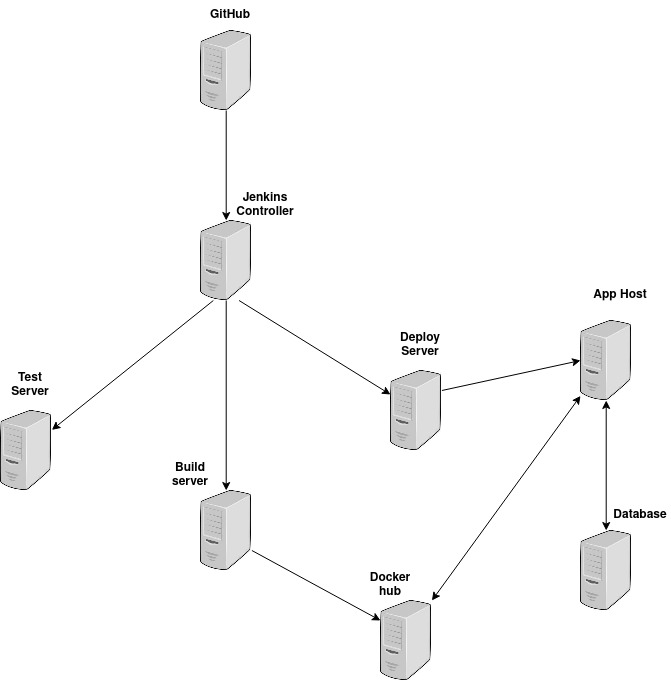

# ChantelM-Project1
Demonstrative Software Delivery Pipeline

- [ChantelM-Project1](#chantelm-project1)
- [About the Project](#about-the-project)
  - [Purpose](#purpose)
  - [Tools](#tools)
  - [File Structure](#file-structure)
- [Pipeline](#pipeline)
  - [Continuous Integration](#continuous-integration)
  - [Continuous Deployment](#continuous-deployment)

# About the Project

## Purpose

Where to Next is an app for maintaining a list of campgrounds. Once a campground has been visited, delete the item number from your list.

## Tools
- [Python 3](https://www.python.org/downloads/)
  - [Flask](https://flask.palletsprojects.com/en/2.1.x/)
  - [Flask-Bootstrap](https://pythonhosted.org/Flask-Bootstrap/)
  - [Flask-WTF](https://flask-wtf.readthedocs.io/en/1.0.x/)
  - [Psycopg2](https://www.psycopg.org/docs/)
- [Jenkins](https://www.jenkins.io/)
  - [Multibranch Scan Webhook Trigger Plugin](https://plugins.jenkins.io/multibranch-scan-webhook-trigger/)
  - [GitHub Plugin](https://plugins.jenkins.io/github/)
  - [SSH Agent](https://plugins.jenkins.io/ssh-agent/)
- [Ansible](https://www.ansible.com/)
- [Docker](https://www.docker.com/)
- [Git](https://git-scm.com/doc)
- [Github](https://github.com/)
- [PostgreSQL](https://www.postgresql.org/)

## File Structure

# Pipeline

Using a webhook, every pull request and push event triggers GitHub to notify the Jenkins controller. Once the controller node receives the event, it cycles through 3 stages based on the specific events information.

## Continuous Integration

The first stage (testing) occurs only when a pull request is sent to the development branch. Testing occurs only on the test server. The results are returned to GitHub to allow for viewing before a pull request is approved.  
 
Once a pull request is approved and merged with the development branch, the building of a Docker image occurs on the build server. A successful build and push to Docker Hub triggers the deployment stage by updating the repository's deployment branch.

## Continuous Deployment

All pushes to the deployment branch trigger the final stage of deploying the application to the host server.